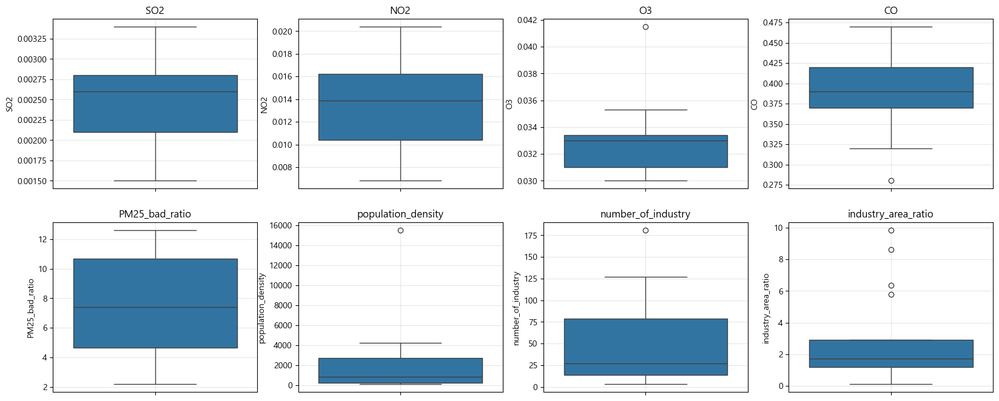
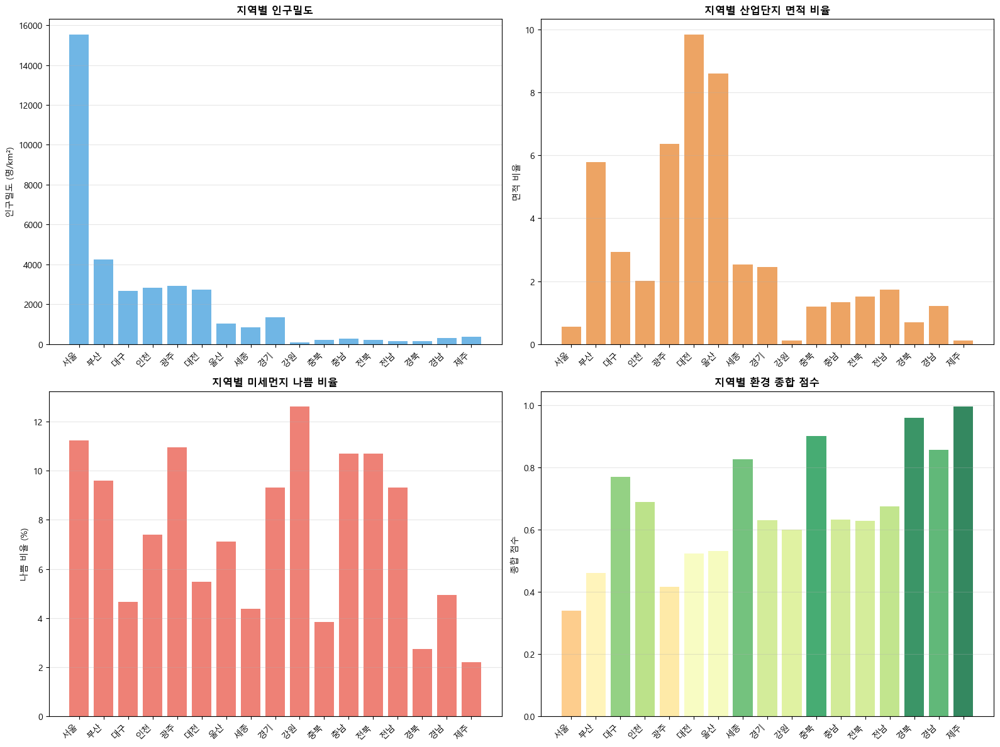
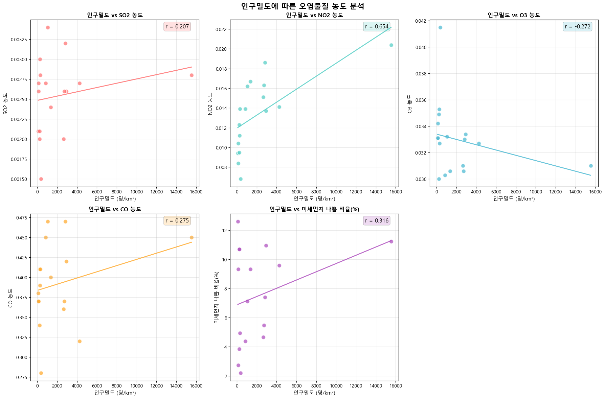
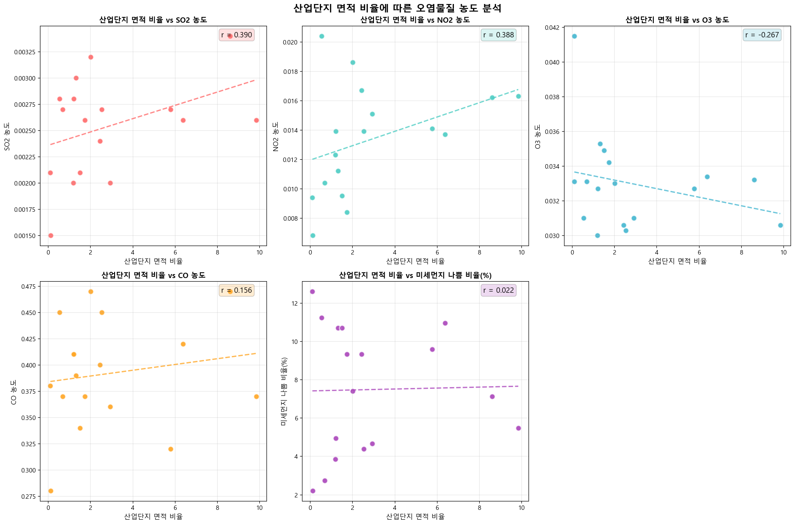
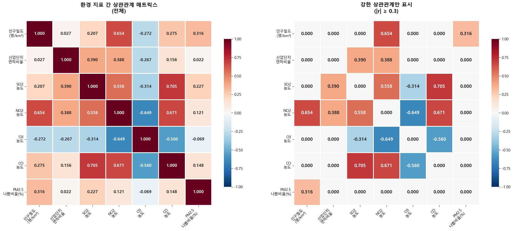


# **프로젝트 명 : 환경 데이터 분석 및 시각화** 🌎

## 🌟**팀명**

## DBalance
 

## 🌟 **팀원 소개**  

| 이름      | GitHub ID                          |
|-----------|------------------------------------|
| 🧑‍💻 최동현  | [@donghyun4957](https://github.com/donghyun4957) |
| 👩‍💻 김수현  | [@K-SH98](https://github.com/K-SH98)        |
| 👩‍💻 김세한  | [@kimsehan11](https://github.com/kimsehan11)          |
| 👨‍💻 성기혁  | [@venus241004](https://github.com/venus241004) |
| 👨‍💻 임길진  | [@LGJ0405](https://github.com/LGJ0405) |

 

## 🛠️ **기술 스택**

| **분류**   | **기술/도구**                                                                                       |
| **분류**         | **기술/도구**                                                                            |
|------------------|------------------------------------------------------------------------------------------|
| **언어**         |      |
| **라이브러리**   |             |
| **협업 툴**      |              |

                                       |

## 📄 **프로젝트 설명**

### 0. 프로젝트 주제 선정 배경

  

[관련 기사 보기](https://www.yna.co.kr/view/AKR20231205065300017)

 

#### 프로젝트 목적
전국 시도별 인구밀도, 산업단지 면적, 대기오염물질 농도, 미세먼지 등급 데이터를 통합 분석하여, 인구밀도, 산업단지, 오염물질 간의 상관관계 및 정책적 시사점을 도출하고, 데이터 시각화를 통해 환경 문제의 인사이트를 제공합니다.

 

### 1. 데이터 선택 근거

* 공공데이터(통계청, 환경부, 국토교통부 등)에서 전국 시도별 인구밀도, 산업단지, 대기오염물질, 미세먼지 등급 데이터를 수집
* 여러 데이터셋을 통합하여 환경 변수 간의 상관관계 및 지역별 불균형을 분석

**데이터 출처**
- 통계청, 환경부, 국토교통부 공공데이터
- 한국환경연구원(KEI) 연구자료
- WHO(세계보건기구) 대기오염 관련 공식 자료

 

---

### 2. 데이터 구조

#### **분석 타겟 컬럼**
- SO2, NO2, O3, CO, PM2.5(미세먼지) 농도, 인구밀도, 산업단지 면적 비율 등

#### **주요 변수**
- `region` : 지역명(시/도)
- `SO2`, `NO2`, `O3`, `CO` : 주요 대기오염물질 농도

- `PM25_bad_ratio` : 미세먼지(PM2.5) 나쁨 비율
- `population_density` : 인구밀도
- `industry_area_ratio` : 산업단지 면적 비율
- `number_of_industry` : 산업단지 수

---

### 3. 데이터 기초 통계량

|       | SO2      | NO2      | O3       | CO       | PM25_bad_ratio | population_density | number_of_industry | industry_area_ratio |
|-------|----------|----------|----------|----------|----------------|-------------------|--------------------|--------------------|
| count | 17.000000| 17.000000| 17.000000| 17.000000| 17.000000      | 17.000000         | 17.000000          | 17.000000          |
| mean  | 0.002541 | 0.013347 | 0.032976 | 0.391765 | 7.477840       | 2112.176471       | 46.176471          | 2.880792           |
| std   | 0.000480 | 0.003724 | 0.002725 | 0.052110 | 3.317169       | 3696.799853       | 50.172497          | 2.955324           |
| min   | 0.001500 | 0.006800 | 0.030000 | 0.280000 | 2.191781       | 91.000000         | 3.000000           | 0.110368           |
| 25%   | 0.002100 | 0.010400 | 0.031000 | 0.370000 | 4.657534       | 220.000000        | 14.000000          | 1.189631           |
| 50%   | 0.002600 | 0.013900 | 0.033000 | 0.390000 | 7.397260       | 833.000000        | 27.000000          | 1.740366           |
| 75%   | 0.002800 | 0.016200 | 0.033400 | 0.420000 | 10.684932      | 2731.000000       | 79.000000          | 2.929153           |
| max   | 0.003400 | 0.020400 | 0.041500 | 0.470000 | 12.602740      | 15533.000000      | 181.000000         | 9.845370           |

---

### 4. 데이터 전처리 및 통합

- 여러 엑셀 파일에서 데이터 추출 및 pandas로 통합
- 결측치 및 이상치 처리, 단위 통일, 지역명 정제 등 전처리 수행

    - 데이터 결측치 처리:

        | 컬럼명                | 결측치 개수 |
        |----------------------|:-----------:|
        | region               |      0      |
        | SO2                  |      0      |
        | NO2                  |      0      |
        | O3                   |      0      |
        | CO                   |      0      |
        | PM25_bad_ratio       |      0      |
        | population_density   |      0      |
        | number_of_industry   |      0      |
        | industry_area_ratio  |      0      |

        > `df.isnull().sum()` 결과, 결측값이 없어 별도 처리는 하지 않음

    - 데이터 이상치 처리:

- 분석에 필요한 변수만 추출하여 최종 데이터프레임 구성
- merge를 이용하여 데이터프레임 전처리
- O3와 CO 변수에서 이상치가 관찰되었으나, O3의 경우 지역의 지형적 특성에 기인한 값으로 판단되어 제거하지 않음.  
- 또한 population_density(인구밀도) 변수의 이상치는 서울에 해당하는 값으로, 대도시의 특성을 반영하는 정상적인 데이터로 간주하여 유지함.  
- 지방의 경우 울산 등 공업 지역에서 산업단지 수가 많은 특성이 있으므로, 해당 변수의 이상치 역시 데이터의 실제 특성을 반영한다고 판단하여 별도의 제거 조치를 취하지 않음.
---

### 4. 데이터 EDA (탐색적 데이터 분석)

#### **4-1. 지역별 변수 막대그래프**

#### **4-2. 인구밀도와 오염물질 농도 관계**
- 인구밀도와 SO2, NO2, O3, CO, PM2.5 등 주요 오염물질 농도 간의 상관관계 산점도 및 추세선 시각화

- 인구밀도가 높은 지역일수록 대기오염 수준이 높은 경향 확인 (단, O3는 제외)

#### **4-3. 산업단지 면적 비율과 오염물질 농도 관계**
- 산업단지 면적 비율과 오염물질 농도 간의 상관관계 시각화

- 일부 지역에서 산업단지 면적이 클수록 특정 오염물질 농도가 높게 나타남

#### **4-4. 전체 변수 간 상관관계 매트릭스**
- 전체 변수 간 상관관계 히트맵 및 강한 상관관계만 표시

---

### 5. 최종 인사이트 및 정책적 시사점

#### 지역적 요인과 오염물질
- 인구밀도와 오염물질 농도 간의 강한 양의 상관관계 확인
- 산업단지 면적 비율이 높은 지역에서 일부 오염물질 농도가 높게 나타남

#### 정책적 시사점
- 인구 집중도와 환경 영향을 고려한 균형 잡힌 도시 개발 필요
- 환경친화적 산업단지 조성 및 기존 단지의 환경 개선 방안 모색
- 지역별 특성을 고려한 맞춤형 환경 정책 수립 필요

### 6. 최종 인사이트 및 정책적 제언

#### 1) 인구밀도와 대기오염
- 인구밀도가 높은 지역일수록 SO2, NO2, PM2.5 등 주요 대기오염물질 농도가 높게 나타남
- 인구 집중이 환경오염에 미치는 영향이 뚜렷하게 확인됨

#### 2) 산업단지와 오염물질
- 산업단지 면적 비율이 높은 일부 지역에서 특정 오염물질 농도가 상대적으로 높음
- 산업단지와 환경오염 간의 연관성 및 지역별 차이 존재

#### 3) 변수 간 상관관계
- 인구밀도, 산업단지, 오염물질 농도 간의 상관관계가 강하게 나타남
- 일부 변수는 지역별 특성에 따라 상관관계가 다르게 나타날 수 있음

#### 4) 정책적 시사점
- 인구 집중 지역의 환경 관리 강화 필요
- 산업단지 환경 기준 강화 및 친환경 기술 도입 확대
- 지역별 맞춤형 환경 정책 수립 및 데이터 기반 정책 평가 필요

## 🌈 **팀원 한 줄 회고**
